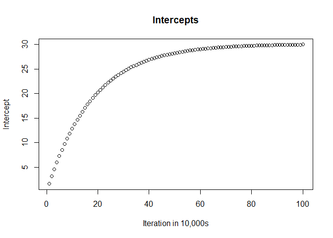

<!-- README.md is generated from README.Rmd. Please edit that file -->

This was the product of a series of assignments in STAT 431 Advanced
Programming in R at Cal Poly SLO, focused on building different
regression methods from scratch in R.

\#\#Demonstration of Regression Methods

\#Ridge Regression

``` r
my_result <- mtcars %>%
  dplyr::select(mpg, hp, cyl) %>%
  ridge_regression(mpg, lambda = 0.5)

mtcars2 <- mtcars %>%
  dplyr::select(mpg, cyl, hp) %>%
  dplyr::mutate(
    cyl = scale(cyl),
    hp = scale(hp)
    )

mass_result <- MASS::lm.ridge(mpg ~ hp + cyl, data = mtcars2, lambda = .5*32/31)

print(mass_result)
#>                  hp       cyl 
#> 20.090625 -1.407689 -3.901186
print(my_result)
#>            hp       cyl lambda
#> mpg -1.407689 -3.901186    0.5
```

\#Selecting best lambda out of list for ridge regression

``` r
lambdas <- 0:10*.1

my_result <- mtcars %>%
  dplyr::select(mpg, hp, cyl) %>%
  ridge_regression(mpg, lambda = lambdas)

print(my_result)
#>              hp       cyl lambda
#> mpg   -1.311038 -4.044565    0.0
#> mpg1  -1.332149 -4.014043    0.1
#> mpg2  -1.352319 -3.984495    0.2
#> mpg3  -1.371601 -3.955867    0.3
#> mpg4  -1.390043 -3.928113    0.4
#> mpg5  -1.407689 -3.901186    0.5
#> mpg6  -1.424583 -3.875045    0.6
#> mpg7  -1.440762 -3.849649    0.7
#> mpg8  -1.456264 -3.824964    0.8
#> mpg9  -1.471122 -3.800954    0.9
#> mpg10 -1.485369 -3.777587    1.0
```

\#Simple Linear Regression via Gradient Descent

``` r
my_result <- mtcars %>%
  slr_gd(mpg, hp, errplot = T)
```



``` r

mass_result <- lm(mpg ~ hp, data = mtcars)

print(mass_result)
#> 
#> Call:
#> lm(formula = mpg ~ hp, data = mtcars)
#> 
#> Coefficients:
#> (Intercept)           hp  
#>    30.09886     -0.06823
print(my_result)
#>   Intercept         hp
#> 1  29.98638 -0.0675954
```

\#Multiple Linear Regression via Gradient Descent

``` r
my_result <- mtcars %>%
  dplyr::select(mpg, hp, cyl) %>%
  mlr_gd(mpg)

mass_result <- lm(mpg ~ hp + cyl, data = mtcars)

print(mass_result)
#> 
#> Call:
#> lm(formula = mpg ~ hp + cyl, data = mtcars)
#> 
#> Coefficients:
#> (Intercept)           hp          cyl  
#>    36.90833     -0.01912     -2.26469
print(my_result)
#>                                 
#> 1 32.11004 -0.03158737 -1.242367
```

\#Multiple Linear Regression via QR Decomposition

``` r

my_result <- mtcars %>%
  dplyr::select(mpg, hp, cyl) %>%
  mlr_qr(mpg)

mass_result <- lm(mpg ~ hp + cyl, data = mtcars)

print(mass_result)
#> 
#> Call:
#> lm(formula = mpg ~ hp + cyl, data = mtcars)
#> 
#> Coefficients:
#> (Intercept)           hp          cyl  
#>    36.90833     -0.01912     -2.26469
print(my_result)
#>     Intercept         hp       cyl
#> mpg  36.90833 -0.0191217 -2.264694
```
